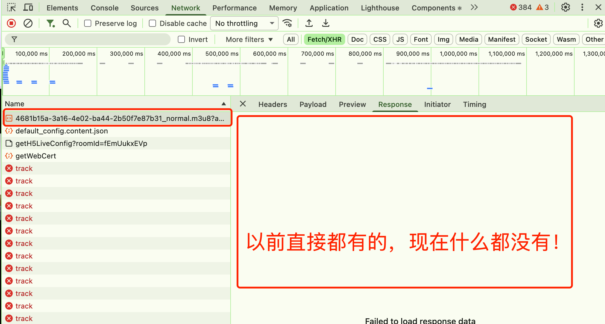
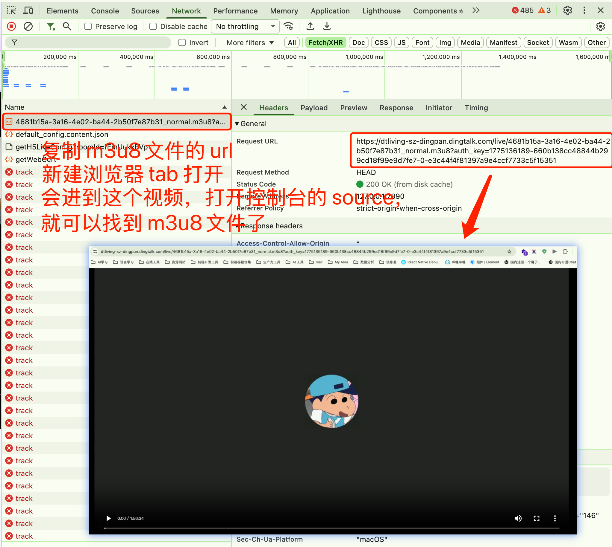
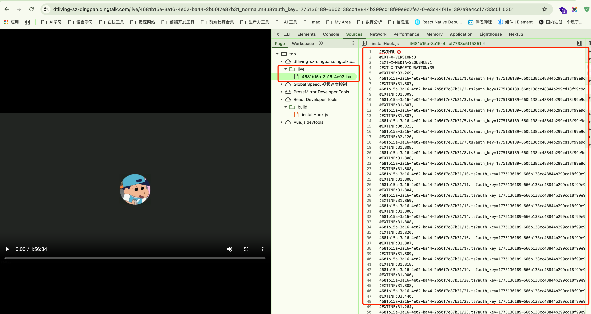

本项目用于钉钉直播回放视频下载

下载本项目后：

- 安装 node 环境
- 确保根目录有一个“ts”文件夹
- 确保你的电脑装有ffmpeg（ffmpeg --version 有东西输出就行），没有的话安装一下，mac 的话直接 homebrew 安装就可以
- 执行`npm run start`即可开始下载

其实想下载很简单，只需要找到对应的 m3u8文件就可以了

但是从26.03.23重新尝试来看，钉钉对于 m3u8的文件的保护又进行了升级，之前直接用猫抓就能嗅探到下载下来，现在已经不行了，猫抓和浏览器后台直接下载都失败了。
**按照下面这个方法就可以：**

- 步骤1：
  
- 步骤2：
  
- 步骤3：
  
